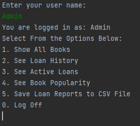
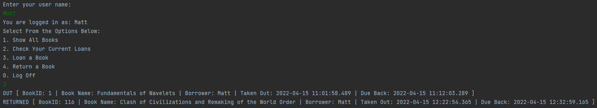

# Java Library Project

About
=====

A command line maven app built in Java to act as an interface for a library. Featurers include:

* Ability to login as an Admin / user or make a new account
* View all books in the library
* Loan out availible books
* Returned loaned books
* Admin reports

Login with Admin Using "Admin"
Login / Create Users using usernames

Specifications
==============

* Read and write data to and from an CSV (achieved with openCSV)
* Read and write data to and from JSON (achieved with jackson)
* Uses multiple classes
* All user interactions should take place in the console
* Users can make accounts (sign in with new name)
* Users cannot use admin priviliges

Screenshots
===========

Admin Login Example

User Login Example, and loan report

